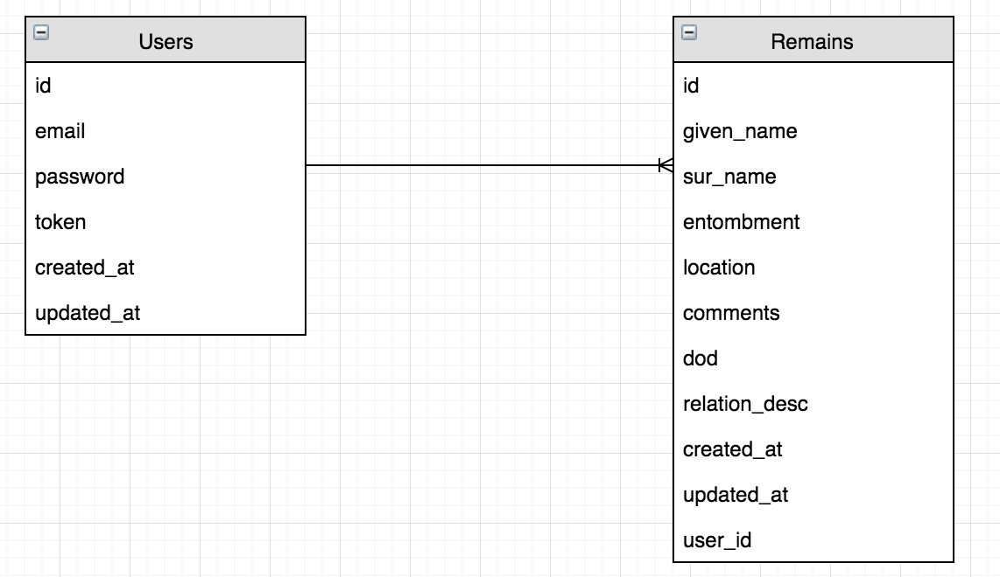

[](https://generalassemb.ly/education/web-development-immersive)


# dirt-napstr API - Capstone

## Description

My capstone project was to build a gravesite tracker appliction.  A user must
be signed in before they can create/view/modify/delete their entries.

## Project Links

#### Back-End Deplpyed
[ProjectApiDeployed](https://octater-dirt-napstr-api.herokuapp.com/)
#### Back-End Repo
[ProjectApiRepo](https://github.com/octater/dirt-napstr-api)

#### Front-End Deployed
[CapstoneClientDeployed](https://octater.github.io/dirt-napstr-client/)
#### Front-End Repo
[CapsonteClientRepo](https://github.com/octater/dirt-napstr-client)

## ERD



## General Approach

As with all the previous projects, I first created the wireframe, user stories,
and ERD. I decided early to use Postgres database and not MongoDB (nothing
against MongoDB, but I felt this was better suited for a sql database).  From
the ERD, I proceeded to get the basic backend tables generated.

Working with it wireframe and user stories, I then started to get a working
CRUD frontend app ready.  I started with the user functions then proceeded to
the remains entries.

Lastly, I tried to beautify the app.  This turned out to be more work than
anticipated.  I wanted to use handlebars, a date picker, and a dropdown this
time.

## Technologies

-   HTML
-   CSS
-   JavaScript
-   Bootstrap
-   Ajax
-   Handlebars
-   Heruko
-   Ruby/Rails
-   Postgres

## API

### Authentication

| Verb   | URI Pattern            | Controller#Action |
|--------|------------------------|-------------------|
| POST   | `/sign-up`             | `users#signup`    |
| POST   | `/sign-in`             | `users#signin`    |
| PATCH  | `/change-password/:id` | `users#changepw`  |
| DELETE | `/sign-out/:id`        | `users#signout`   |

#### POST /sign-up

Request:

```sh
curl http://localhost:4741/sign-up \
  --include \
  --request POST \
  --header "Content-Type: application/json" \
  --data '{
    "credentials": {
      "email": "'"${EMAIL}"'",
      "password": "'"${PASSWORD}"'",
      "password_confirmation": "'"${PASSWORD}"'"
    }
  }'
```

#### POST /sign-in

Request:

```sh
curl http://localhost:4741/sign-in \
  --include \
  --request POST \
  --header "Content-Type: application/json" \
  --data '{
    "credentials": {
      "email": "'"${EMAIL}"'",
      "password": "'"${PASSWORD}"'"
    }
  }'
```

#### PATCH /change-password/:id

Request:

```sh
curl --include --request PATCH "http://localhost:4741/change-password/$ID" \
  --header "Authorization: Token token=$TOKEN" \
  --header "Content-Type: application/json" \
  --data '{
    "passwords": {
      "old": "'"${OLDPW}"'",
      "new": "'"${NEWPW}"'"
    }
  }'
```

#### DELETE /sign-out/:id

Request:

```sh
curl http://localhost:4741/sign-out/$ID \
  --include \
  --request DELETE \
  --header "Authorization: Token token=$TOKEN"
```

### Remains

| Verb   |  URI Pattern    |  Controller#Action  |
|--------|-----------------|---------------------|
| GET    | `/remains`      | `remains#index`     |
| POST   | `/remains`      | `remains#create`    |
| PATCH  | `/remains/:id`  | `remains#update`    |
| DELETE | `/remains/:id`  | `remains#destroy`   |

#### GET /remains

Request:

```sh
curl --include --request GET http://localhost:4741/remains \
  --header "Authorization: Token token=$TOKEN"
```

#### POST /remains

Request:

```sh
curl --include --request POST http://localhost:4741/remains \
  --header "Authorization: Token token=$TOKEN" \
  --header "Content-Type: application/json" \
  --data '{
    "remain": {
      "given_name": "'"${GN}"'",
      "sur_name": "'"${SN}"'",
      "entombment": "'"${E}"'",
      "location": "'"${L}"'",
      "comments": "'"${C}"'",
      "dod": "'"${DOD}"'",
      "relation_desc": "'"${RD}"'"
    }
  }'
```

#### PATCH /remains/:id

Request:

```sh
API="${API_ORIGIN:-http://localhost:4741}"
    URL_PATH="/remains/$ID"
    curl "${API}${URL_PATH}" \
      --include \
      --request PATCH \
      --header "Authorization: Token token=$TOKEN" \
      --header "Content-Type: application/json" \
      --data '{
        "remain": {
          "given_name": "'"${GN}"'",
          "sur_name": "'"${SN}"'",
          "entombment": "'"${E}"'",
          "location": "'"${L}"'",
          "comments": "'"${C}"'",
          "dod": "'"${DOD}"'",
          "relation_desc": "'"${RD}"'"
        }
      }'
```

#### DELETE /remains/:id

Request:

```sh
API="${API_ORIGIN:-http://localhost:4741}"
    URL_PATH="/remains/$ID"
    curl "${API}${URL_PATH}" \
      --include \
      --request DELETE \
  --header "Authorization: Token token=$TOKEN"
```

## Unsolved Problems or Major Hurdles

No unsolved or known problems.  One hurdle was ensuring only values in a
dropdown field is valid when adding or updating a record


## Install Instructions

No special install instructions.


## [License](LICENSE)

1.  All content is licensed under a CC­BY­NC­SA 4.0 license.
1.  All software code is licensed under GNU GPLv3. For commercial use or
    alternative licensing, please contact legal@ga.co.
